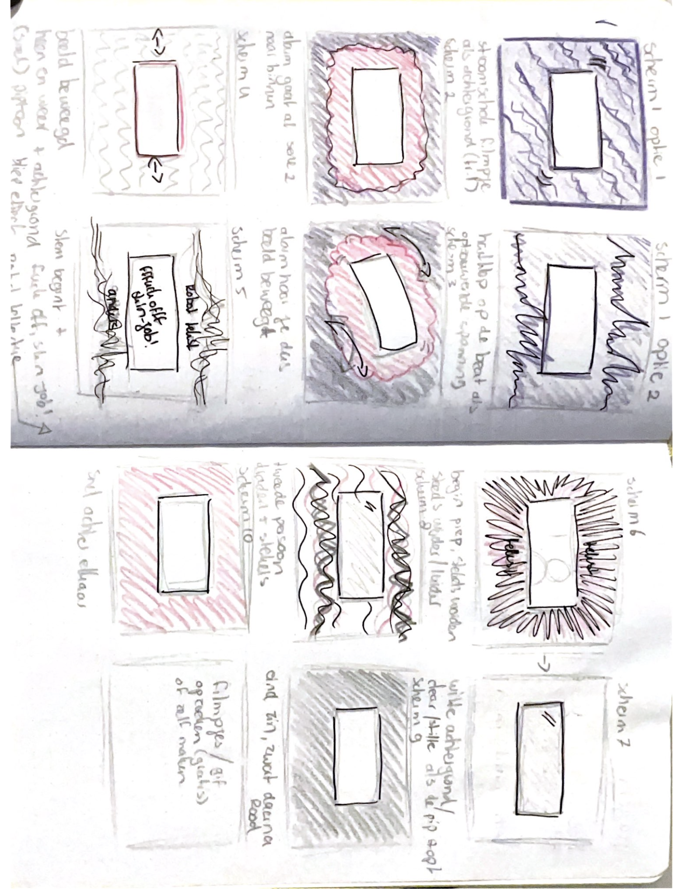

# Web Typography, 2020/2021

Als je doof bent, of als je om een andere reden geen geluid kunt horen, dan mis je veel informatie als je een film kijkt. Knisperende voetstappen, langzaam aanzwellende muziek, nerveus getik op een deur, je hoort het natuurlijk allemaal niet. Nu bestaat er zoiets als *closed caption*, wat een type ondertiteling is waarbij ook dingen als omgevingsgeluiden en de muziek beschreven worden. Hierdoor krijgt een kijker die informatie wel binnen.

Alleen wordt die auditieve informatie nogal neutraal beschreven. Het geluid van huilend persoon zou bijvoorbeeld beschreven kunnen worden als *snikgeluid op de achtergrond*. En iemand die lacht zou geschreven kunnen worden als *iemand lacht.* Heel neutraal, bijna zakelijk, en bovendien allebei in precies hetzelfde neutrale lettertype. Terwijl het toch echt over twee heel verschillende emoties gaat. 

Dat kan visueel sterker. 

En dat gaan jullie doen.

## Leerdoelen

- Je kan de kennis over vormgeving die je hebt opgedaan tijdens de minor technisch toepassen met behulp van CSS
- Je kan verborgen nuance uit een audiotrack overtuigend vertalen naar visuele (typografische) beelden
- Je kan je typografische keuzes onderbouwen.
- Je hebt de exclusive design principles gebruikt.

## Oplevering

Je levert een werkende versie op, gemaakt met HTML, CSS en JavaScript. Deze staat op Github. In een duidelijke readme documenteer en onderbouw je je ontwerpkeuzes. Je developmentgeschiedenis is terug te vinden op GitHub.

Je levert ook een *screen recording* met audio op van je fragment. Dit is een video van de definitieve versie, gemaakt van jouw browserscherm.

De beoordeling is mondeling en volgt [de rubric uit het beoordelingsformulier](web-typografie-beoordeling.pdf).

## Typografische restricties

Je *moet* een van deze twee opties kiezen, en je keuze moet je onderbouwen. In je readme staat een uitleg over je overwegingen om de ene of de andere restrictie te kiezen.

### Optie 1: Systeemfont

De eerste optie is dat je gebruik maakt van het zogenaamde *systeemfont* van degene die naar jouw werk kijkt. Dit font verschilt per operating system, en het verschilt soms zelfs per versie van het operating system. Het is ook aan te passen door de gebruiker zelf. 

Je hebt dus geen controle over welk lettertype er precies gebruikt wordt. Het levert dus een onzeker, en beperkt typografisch palet op. Je hebt geen *light* versies, of *extrabold*. En ook geen serif en sans-serif versie van dezelfde familie. In dit geval heb je alleen de beschikking over normal, **bold** en _italic_. Dit heeft natuurlijk ook zijn voordelen!

### Optie 2: Brenner

Je kan er ook voor kiezen om gebruik te maken van de complete Brenner familie. Dit is een zeer uitgebreid en uiterst flexibel font. [Hier kan je je verdiepen in dit font](https://www.typotheque.com/blog/brenner_an_unusual_typeface_family_with_distinct_voices). Als je kiest voor dit font dan heb je de beschikking over een *sans serif*, een *condensed*, een *serif*, een *monotype*, een *slab*, een *display* en een *script* versie. En veel van deze versies hebben varianten van *light* tot *bold*, en allemaal zowel *bold* als *italic*.

Met Brenner zijn er natuurlijk veel en veel meer mogelijkheden dan met systeemfonts. Dat kan zowel een voordeel als een nadeel zijn. 

Voor een overzicht, zie [de brenner.pdf](brenner.pdf).

## Het fragment

Ik heb een fragment voorbereid. Het gaat om twee scenes uit *Blade Runner 2049*. De captions staan in de HTML, en ze verschijnen in sync met de video. [Kijk maar](closed-captions/index.html).

### De captions

De captions staan in de html, in het bestand index.html. Je kan aan elke paragraaf eventueel een of meer classes toevoegen. Bijvoorbeeld `voice1` of `voice2 soft`. Classes voeg je handmatig toe in de html.

Met JavaScript worden er een paar dingen extra gedaan: 

- er wordt aan elke paragraaf een unieke class toegevoegd (`p0`, `p1`, etc)
- Elk woord wordt in een aparte `span` gezet. Hierdoor kan je elk woord apart stylen, en eventueel ook [na elkaar laten verschijnen](https://github.com/cmda-minor-vid/web-typography-18-19/blob/master/closed-captions/css.css#L41).

### Tijdens het afspelen

Tijdens het afspeelen wordt er een class `on` op de caption gezet als hij moet verschijnen, en een class `off` als hij klaar is. *Zowel class `on` als class `off` blijft op de caption staan!*

De timimg van de captions kan je aanpassen in [closed-captions/captions.js](closed-captions/captions.js).

Er verschijnen ook classes op de body op momenten dat er geluiden worden afgespeeld, zoals `sound1` en `sound2`. Je kan geluiden toevoegen in [closed-captions/sounds.js](closed-captions/sounds.js).

*let op,* de geluiden zijn niet compleet, dit zal je zelf moeten aanvullen.

## Een eigen fragment (afgeraden, uitgebreide onderbouwing is nodig)

Je kan er ook voor kiezen om een eigen, *beter* fragment te gebruiken. Dit wordt afgeraden. De tijd die je besteedt aan het zoeken naar dat fragment kan je beter besteden aan het werken aan de opdracht. Bovendien blijkt dat er vaak fragmenten worden gekozen die niet goed voldoen aan de opdracht. Als je een ander fragment kiest dan *moet* je dit goed onderbouwd voorleggen aan je docent. De deadline hiervoor is vrijdagochtend in de eerste week.

### Waar moet je op letten bij het kiezen van een eigen fragment.
Lees de opdracht nog eens goed door. Waar gaat het ook al weer precies om? 

Voor een goede onderbouwing van je keuze voor een ander fragment moet je deze vragen in elk geval beantwoorden:

- Welke informatie zit er in de audio die echt niet zichtbaar is?
- Welke rol speelt de audio in het fragment?
- Werkt de scene nog zonder geluid?
- Waarom is dit fragment beter dan het aangeboden fragment?

Je kan dan de nodige HTML en JavaScript genereren door gebruik te maken van [caption generator](https://cmda-minor-vid.github.io/web-typography-18-19/generator/) (in Google Chrome). 

Als je de closed captions wil bewerken dan kan je een tool zoals [Amber Script](https://www.amberscript.com/en) gebruiken. Daar kan je exporteren als `.srt`, en die kan je weer door de generator halen.

## Verslag Milou Mulder

### Week 1:

Deze week begon een beetje moeizaam. De eerste twee dagen was ik ziek en de dag daarna 
heb ik alles moeten inhalen. Gelukkig ging dat goed door veel hulp van mijn 
mede leerlingen. Nadat ik alle bestanden had gedownload, heb ik eerst een aantal dingetjes uitgeprobeerd en 
heb met het feedback gesprek veel inspiratie opgedaan van andere. 

Ik heb onder andere gespeeld met kleur, schaduw, plaats van de tekst, het font zelf en animaties. 
De tekst heb ik bijvoorbeeld verplaatst zodat het meer een dialoog vormt. 

Voice 1 staat bovenaan met iets grotere tekst. Dit omdat ik vind dat de man die spreekt een beetje bazig/niet heel vriendelijk klinkt.
Voice 2 staat onderaan met iets kleinere tekst. Dit omdat deze man iets onderdaniger klinkt, maar ook wel een beetje als een robot. Hier heb ik ook het font op uitgekozen.

Hieronder zie je een aantal ideetjes uigewerkt in schetsen.

### Vakantie: 

In mijn vakantie heb ik gewerkt aan verschillende aninimaties op de goede plek zetten (vormgeving van de geluiden). Als je bijvoorbeeld een alarm 
hoort, zie je het beeld bewegen. Zo krijg je een beetje hetzelfde gevoel als wanneer je de video met geluid bekijkt. 

Ook heb ik verschillende achtergronden uitgeprobeerd, bij verschillende scenes. Ik wilde ook graag de hoge piep in een van de 
scenes duidelijk maken voor de kijker door te spelen met een andere achtergrond/gifje. Uiteindelijk heb ik een animatie gemaakt waardoor het beeld steeds sneller beweegt en dus ook irritanter wordt.

Ik kwam erachter dat de tekst op sommige plekken nog niet helemaal goed stond als ik het scherm groter maakte en dat sommige 
tekst een beetje weg viel door de kleur. Dit wilde ik aanpassen, maar dat is mij nog niet gelukt. Ik zou ook aan het begin een schaduw willen toevoegen bij voice 2. Aan het begin loopt er ook een stukje tekst niet helemaal lekker en wil dat 
ook nog veranderen na het feedback gesprek. 

Verder heb ik nog gekeken hoe ik het stukje tekst "fuck off skinjob" iets snauwender over kon laten komen. Ik heb gespeeld met kleur, 
ik heb de tekst verplaatst naar het hoofd van de man die het zegt en heb er wat fjes bij gezet. Ik heb door de vele fjes iets meer dat 
fffffuck off, te laten zien. 

vragen voor volgende feedback gesprek:

- Hoe maak je een schaduw achter je tekst in css?
- Hoezo gaat mijn tekst eerst naar het midden en dan naar beneden (scene aan het begin)
- Hoe zet je een afbeelding in je readme?

### Week 2:

Wat ik nog wil veranderen:

- beweging bij de piep iets sneller laten gaan op het einde
- letters niet mee laten bewegen op de trilling van het filmpje
- letters een andere kleur geven voor duidelijkheid 
- tekst beter positioneren 
- fuck off skinjob, iets groter/ leesbaarder maken 
- einde van fragment 2 nog animeren/ tekst goed zetten (misschien nog een gifje toevoegen)

Het was mij nog niet gelukt om de kleur van de tekst te veranderen en de grote aan te passen. Dit kwam uiteindelijk omdat 
ik een te grootte em als bottom en left gebruikt had. Waardoor mijn tekst uit beeld verdween. Weer wat geleerd. Dat is 
dus opgelost.

Ook heb ik het stuk tekst wat versprong in de video gefixt. Nu blijft de tekst boven en onder op dezelfde plek staan.

En heb ik de tekst los gemaakt van de video waardoor deze niet mee beweegt met de trilling (tijdens het irritante piepgeluid).

Bij het tweede fragment heb ik een gifje toegevoegd en heb ik een nieuwe animatie gemaakt. Het 
beeld beweegd nu heen en weer. Dit vond ik goed passen bij het geluid. Omdat ik gifjes gebruik, heeft het er wel voor gezorgd
dat mijn bestand te groot is voor github. Comprimeren van de gifjes had ook geen zin, dus nu heb ik in github de gifjes even weggehaald. 
In mijn schermopname zal ik uiteraard wel de gifjes laten zien (als achtergrond). 

### Onderbouwing keuzes:

#### Geluid vormgeven

Begin van de video hoor je al meteen een wat harder geluid. Hier heb ik het scherm naar voren en naar achter laten bewegen. Ik heb hiermee een geluid proberen te nabootsen. Later in de video hoor je nog een aantal aparte geluiden en heb ook daar dezelfde animatie voor gebruikt. Het bewegen van het beeld staat bij mij dus voor geluiden. 

Bij het tweede geluid heb ik een rode schaduw toegevoegd, door het nog wat dramatischer over te laten komen. Deze wordt later grijs. 

Het begin van de video deed me een beetje denken aan iets buitenaards/spannends. Ik vond het gifje op de achtergrond erg passen bij het spannende begin. Ik hoop hiermee ook de sfeer iets meer over te laten komen voor dove mensen. 

Bij de scene met het irritante piep geluid heb ik de video steeds sneller laten bewegen. Net als het geluid. Zo heb je alsnog een beetje hetzelfde gevoel bij deze scene. De tekst beweegt niet mee, waardoor je deze nog wel kan lezen. 

Bij fragment 2 heb ik een gifje gebruikt als achtergrond. Dit gifje vond ik goed passen bij de sfeer van de video en de kleuren matchen met het eerste gifje die ik heb gebruikt. Ook heb ik de video laten bewegen van links naar rechts. Dit geeft een goed beeld van het geluid dat er is. Een beetje zeurderig geluid heb ik gekoppeld aan een wat langere beweging. 

Aan het eind van de video wilde ik de achtergrond op wit zetten, zoals ik dat bij de vorige scene had gedaan. Dit is me helaas niet gelukt. Zo had er wel een duidelijker eind aan gezeten.  

Tekst

Voice 1 heb ik aan de bovenkant gezet en voice 2 aan de onderkant. Voice 1 heb ik aan de bovenkant gezet omdat die veel baziger overkomt dan voice 2.Daarom is de tekst ook groter. Ik heb voice 1 een witte kleur gegeven, omdat deze goed opvalt. Voice 2 staat dus aan de onderkant omdat deze wat onderdaniger overkomt. De tekst heb ik daarom ook wat kleiner gemaakt. Voice 2 heb ik een groene kleur gegeven, omdat deze bij de achtergronden goed op viel en bij de sfeer van de video paste. Doordat de verschillende "voices" een andere kleur hebben, onderscheid je ze ook makkelijker van elkaar. 

Ik heb gekozen voor het font "brenner" omdat ik hier meer controle heb. Nu kan ik bepalen welke welke lettertypes er gezien worden, dus kan ik ook wat creatiever zijn. Ik wilde sowieso een iets wat dikkere en grotere letter voor voice 1, omdat deze wat bazig en duidelijk over komt. Daarom heb ik uiteindelijk gekozen voor "brenner Display Black". 

Voor voice 2 wilde ik een iets wat suptielere letter. Iets dunner maar ook iets blokkiger. Blokkiger, omdat ik deze stem een beetje robot achtig vind klinken. Dunner, omdat deze stem wat onderdaniger is. Daarom heb ik uiteindelijk gekozen voor " Brenner Mono". 

Voice 2 en 3 komen niet vaak voor en zijn niet heel belangrijk. Daarom wilde ik ze een neutraal letterype geven. Niet al te opvallend. Ik heb daarom gekozen voor "Brenner Sans Condensed Bold". Deze is wel duidelijk voor dat specifieke moment, maar verder heel neutraal. 

Bij de scene "fuck off skinjob" heb ik de tekst geel gemaakt, waardoor het duidelijker is dat het een andere stem is. Ook heb ik het een beetje klein gehouden, omdat het dan iets sneerderiger over komt. Ook heb ik iets meer fjes neergezet, omdat het zo beter/sneerderiger overkomt. 

De tekst na het irritante piep geluid heb ik donker groen gemaakt, waardoor hij onderscheid maakt van de rest en je zo dus weet dat het een ander persoon is die praat. De puntjes achter constant k... Heb ik erachter gezet, omdat dat meer de manier is waarop de man dit zinnetje zegt. Hij laat een kleine stilte vallen.

Bekijk de video op dlo

